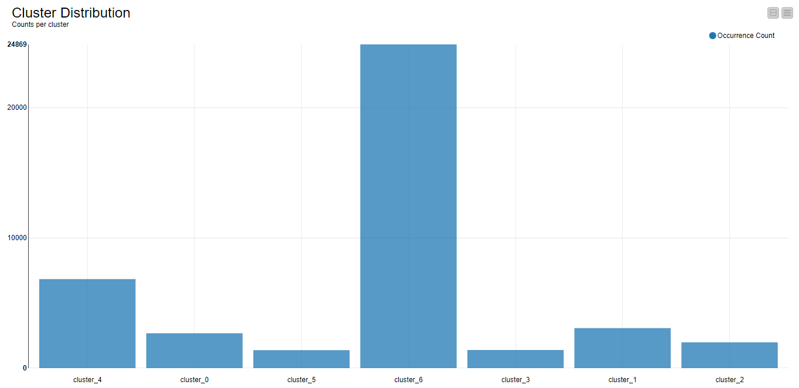
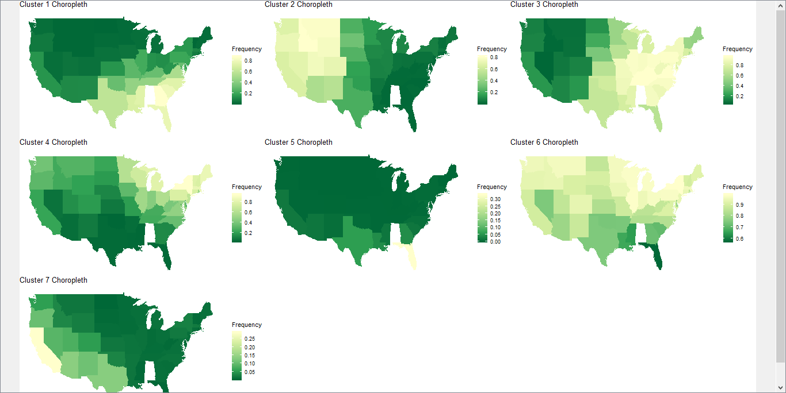
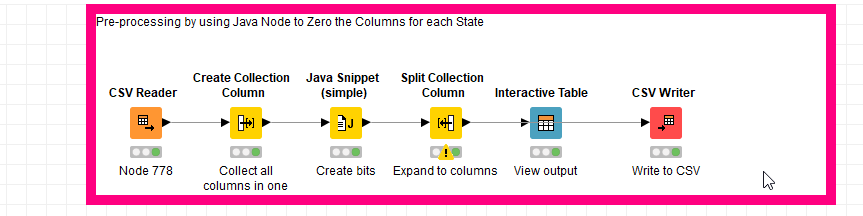
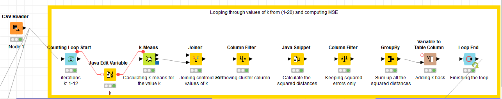

\newpage{}

Term Report: Artificial Intelligence
===================

## The Problem

*Given a set of all plants (species and genera) that occur in the states of USA and Canada, can we find a way to group these plants whose members are similar in some way?*

## The Data

### Dataset
The dataset was taken from the [United States Department of Agriculture’s official website](https://plants.sc.egov.usda.gov/java/) from their plants database which is where they maintain a collection of all plants found in U.S and its related territories.

### Data Description
The data consisted of 34,782 rows of plants recorded in a data file. A couple of lines are shown below as a sample:

`
hibiscus aculeatus,al,fl,ga,la,ms,nc,sc,tx
hibiscus arnottianus,hi
`

The first column contained the name of the plant (including species and genre) specified before the comma delimiter, which was followed by a list of arbitrary length containing the abbreviations of the states where it was found. For example,_fl_ stands for Florida, _hi_ stands for Hawaii, and so on.


## Pre-processing


Before we could use this data for analysis, it needed to undergo a series of steps so that it would be cleaned and formatted for the model to be applied. Following are the steps that were undertaken for this dataset.

1. First the data was formatted with a .data extension, we changed it to a .csv extension so that it could be read by the CSV-Reader in Knime
2. Secondly, we needed to tabulate a list of abbreviations of all of the states possible.
   - For this, the *plants.name* data column as reference was stripped down the full name and kept the abbreviation only.

3. Thirdly, we had to remove the name of the plant as it was irrelevant in this case. Ideally, we would want to predict an unknown plant belonging to a cluster, so there was no use storing the name beforehand.
4. And lastly, which was the major chunk of preprocessing, which consisted of re-encoding the data file into binary classification of a table of dimension


```
(69 x 34,782) with each column representing whether a plant was found
on that particular state or not.
```

## The Algorithm: K Means

K-Means is an unsupervised algorithm that groups dataset into K clusters. The algorithm takes a parameter 'k' to partition the dataset. The algorithm usually starts by assigning random data point cluster assignments and calculates each point's Euclidean distance to every cluster's centroid mean. However, some variations also use medians or mediods to find the closest cluster as sometimes averages can be misleading and are susceptible to outliers. We usually run iterations of this algorithm until the K-means algorithm finally converges and no cluster reassignments are made. One crucial point of discussion is regarding selecting the 'best' value of K, but as this is an unsupervised algorithm the actual number is unknown to us. However, we will discuss one of the methods that can be used to gauge an ideal value for the dataset.


## Evaluation Metric

The evaluation metric we have used for this data is the Elbow Graph, where we iterated through different values of K and found the one which had the optimal number of clusters.


The measure we used to determine how well a k-means clustering is using SSE(Sum of Squared Error ) SSE is defined as:


Following were the SSE scores for each cluster:


| Cluster Size | Sum of Squared Errors (within clusters) |
|--------------|-----------------------------------------|
| 1            | 265308                                  |
| 2            | 178031                                  |
| 3            | 162177                                  |
| 4            | 151962                                  |
| 5            | 146954                                  |
| 6            | 133373                                  |
| 7            | 126976                                  |
| 8            | 125014                                  |
| 9            | 121955                                  |
| 10           | 118265                                  |
| 11           | 113450                                  |
| 12           | 108267                                  |

## Post-processing

To see that the clustering was being performed currently, we need to visualize the clusters it has formulated. The problem is that the dimensions of the dataset are 69 and thus we need some way to project it on a 2D-axes.

One of the most popular methods is the Principal Component Analysis which is well-suited for dimensionality reduction so we can visualize it by projecting our data on a 2D-Plane. Using the color manager, we can also show the grouping of the clusters as well visually.


## Results

### Grouping of Clusters



With the help of the bar char we can clearly see the eventual cluster distribution as the grouping the plants have been assigned to each group. The graph, however, shows an uneven class distribution with cluster 6 being the most popular candidate cluster.  One thing to mention is that the number of epochs used due to time constraints was 150, choosing a higher number perhaps would have resulted in a different, and arguably more accurate distribution. Also, we know, that there could have been multiple k-values for the clusters. For this case, **k=7** was chosen because it was deemed a 'good' grouping. There can be other possible groupings as well.

### Cluster Density Across Geographical Regions



One of the main limitations for this algorithm is the absence of the underlying reason which can be used to attribute the reason for the formation for such groups. One possible hypothesis is that given the botanical nature for the dataset, there might be a geographical factor at play. We decided to further our analyses by constructing a choropleth for the USA Regional Map. We binned each state based on the categorical count obtained per cluster. As a result, we obtained 7 different choropleths, one representative of each cluster. For example, we can see in the figure below that in Cluster 2 the south-eastern states are more dominant which can be contrasted to Cluster 2 where the predominant plants lie in the North Western States.
This was implemented using R’s statistical package _ggplot2_ to visualize the clustering across the USA states. It was therefore necessary for the data to be grouped corresponding to its relevant region. This was achieved through constructing a new table joined by the state map and the cluster regional distribution.


## Conclusion

To conclude, we can say that the clustering done by K-Means is valid as distinct sets were identified which the plants may belong to. This corresponds to particular hot-spot regions in the graph as shown above. While it is not possible to solely attribute this to geographical factors, but there is certainly a presence of a similarity which can group plants on this criteria.

## Remarks and Recommendations


Since this is an unsupervised learning algorithm we cannot say much about the reason why such groups were particularly chosen with this distribution.
Following might be some of the factors involved which might have influenced grouping these plants together

- Geographical/Territory-wise segmentation
- Sharing some physical botanical features with the other plants
- Certain climatic conditions or certain requirements (for example water consumption of the plant)
  
For a better recommendation we need to have some domain knowledge behind this dataset which in this case is severely lacking.
However, this clustering can help the USDA to find what were the underlying similarities of certain plants that made them to be grouped together. Furthermore, by seeing the geographical distribution of the plants, the USDA can target bundles of plants belonging to specific regions for agricultural activities rather than targeting them separately which might prove to be expensive.

This data also can be particularly useful for the taxonomy of botanical systems and drawing feature similarities and differences between the botanical species.


## Software Used

- KNIME Analytics Platform
- Microsoft Excel
- R (*ggplot2*) and Python

## Screenshots of KNIME Workflows






