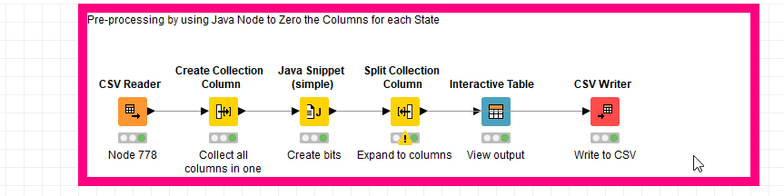
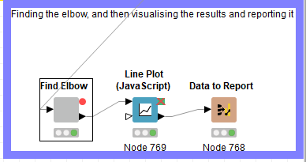
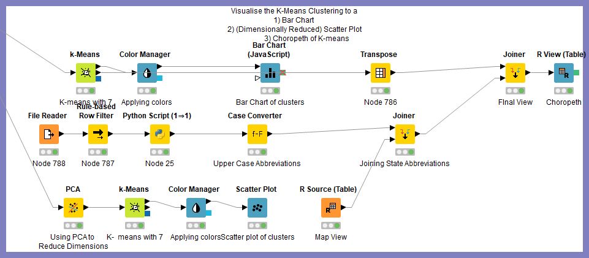
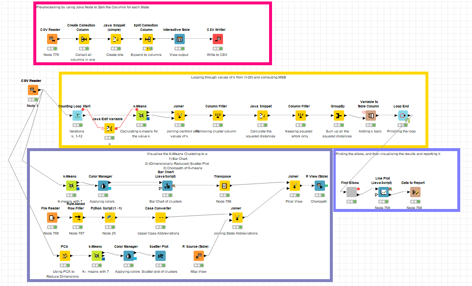
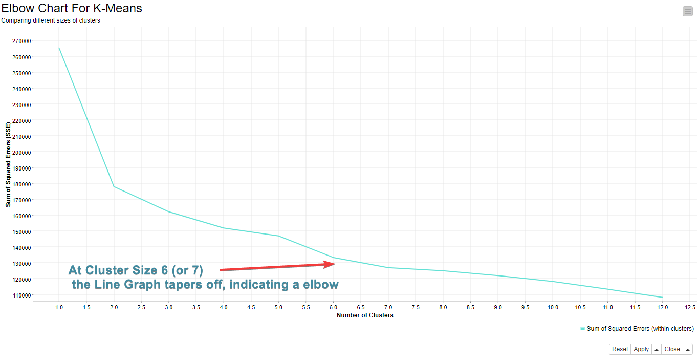
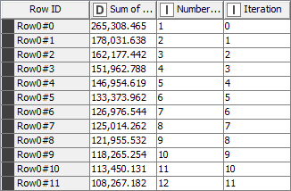
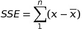
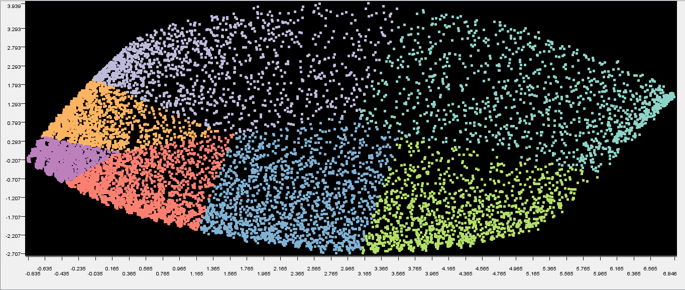
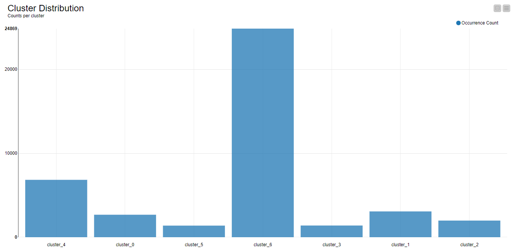

### Term Report Artificial Intelligence by Sualeh Ali ###

K-Means Clustering of USDA Plants Dataset
=======


## The Problem

Given a set of all plants (species and genera) that occur in the states of USA and Canada, Can we find a way to group these plants whose members are similar in some way?

## The Data

### Dataset

The dataset was taken from the [United States Department of Agriculture's official website](https://plants.sc.egov.usda.gov/java)
from their plants database which is where they maintain a collection of all plants found in U.S and it's related territories.

## Data Description

The data consisted of 34,782 rows of plants recorded in a data file.
A couple of lines are shown below as a sample:

```
hibiscus aculeatus,al,fl,ga,la,ms,nc,sc,tx
hibiscus arnottianus,hi
```

The first column contained the name of the plant (including species and genre) specified before the comma delimiter, which was followed by a list of arbitrary length containing the abbreviations of the states where it was found.
For example, *fl* stands for Florida, *hi* stands for Hawaii, and so on.

## Pre-processing

Before we could use this data for analysis, it needed to undergo a series of steps so that it would be cleaned and formatted for the model to be applied.
Following are the steps that were undertaken for this dataset.

1. First the data was formatted with a *.data* extension, we changed it to a *.csv* extension so that it could be read by the CSV-Reader in Knime
2. Secondly, we needed to tabulate a list of abbreviations of all of the states possible.
	* For this, I used the *plants.name* as reference and stripped down the full name and kept the abbreviation only.
3. Thirdly, we had to remove the name of the plant as it was irrelevant in this case. Ideally, we would want to predict an unknown plant belonging to a cluster, so there was no use storing the name beforehand.
4. And lastly, which was the major chunk of preprocessing, which consisted of re-encoding the data file into binary classification of a table of dimension *(69 x 34,782)* with each column representating whether a plant was found on that particular state or not.

## Post-processing


## Screenshots of KNIME Workflows












## Evaluation Metric




The evaluation metric we have used for this data is the Elbow Graph, where we iterated through different values of K and found the one which had the optitmal number of clusters.

The measue we used to determine how well a k-means clustering is using SSE (Sum of Squared Error )
SSE is defined as:



## Post-processing




To see that the clustering was doing currectly, we need to visualise the clusters it has formulated. The problem is that the dimensions of the dataset are 69 and thus we need some way to project it on a 2D-axes.

The method I have employed is basically [Principal Component Analysis](https://en.wikipedia.org/wiki/Principal_component_analysis) for dimensionality reduction so we can visualise it by projecting it in a 2D-Plane. I have used the color manager, to show the grouping of the clusters as well.


## Results



We can clearly see the grouping the plants have been assigned to each group. One thing to mention is that the number of epochs I have used due to time constraints was 150, choosing a higher number perhaps would have resulted in a different, and arguably more accurate distribution.
Also, we know, that there could have been multiple k-values for the clusters. For this case, I have chosen k=7 because it deemed a good grouping. There can be other possible groupings as well.

## Conclusion

To conclude, we can say that there is a clustering of the plants dataset as there have been distinct sets identified which the plants may belong to.

## Remarks and Recommendations

Since this is an unsupervised learning algorithm we cannot say much about the reason why such groups were particularly chosen with this distribution.
Following might be some of the factors involved which might have influenced grouping these plants together

* Geographical/Territory-wise segmentation
* Sharing some physical botanical features with the other plants 
* Certain climatic conditions or certain requirements (for e.g water consumption of the plant)

For a better recommendation we need to have some domain knowledge behind this dataset which in this case is severly lacking.

## Software Used

* KNIME Analytics Platform
* Microsoft Excel